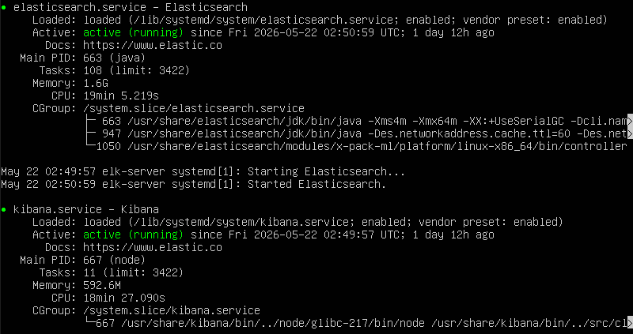
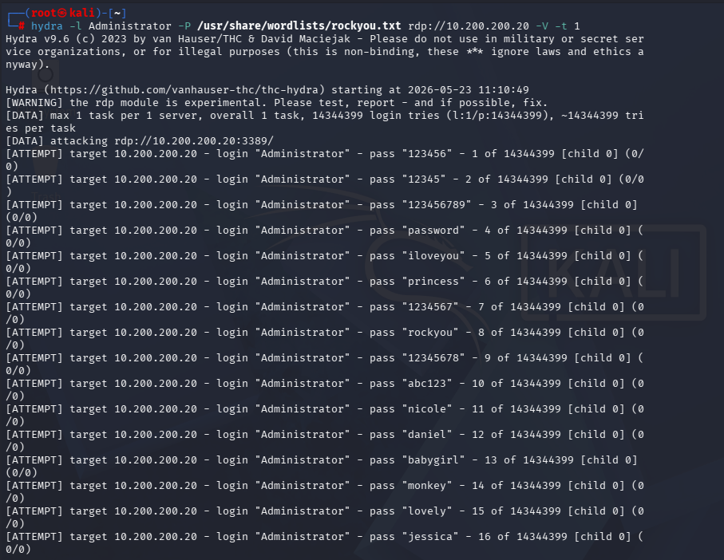
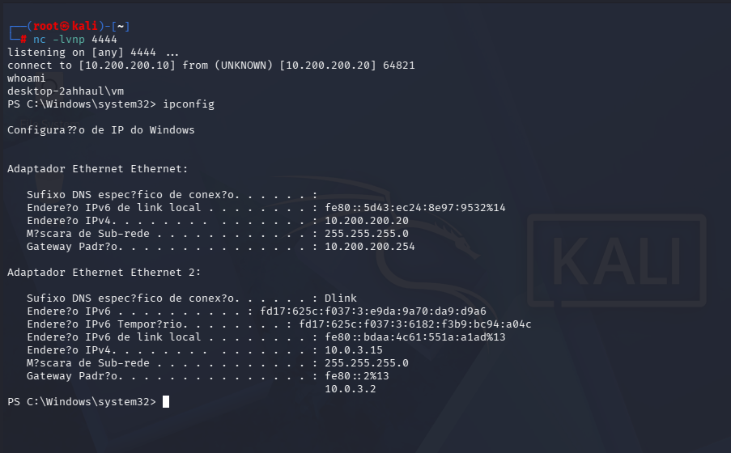
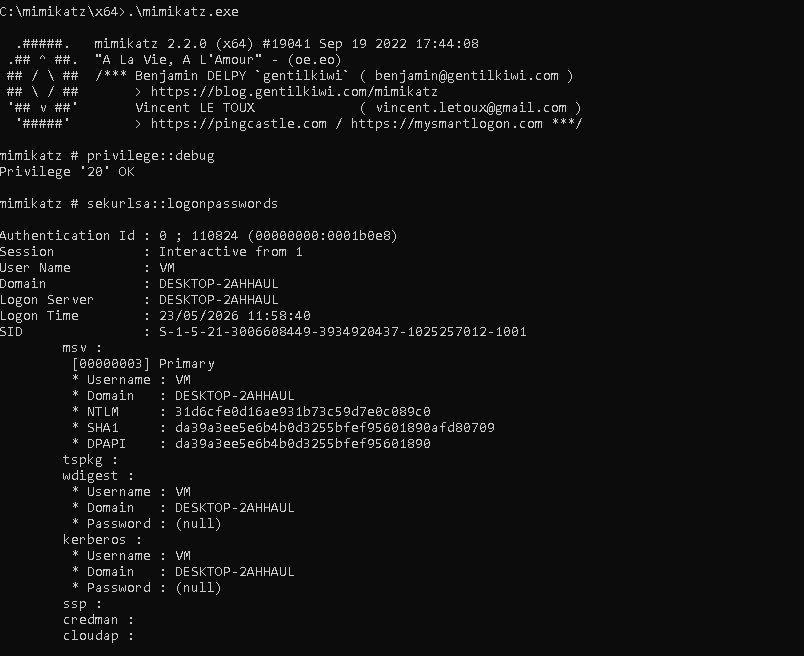
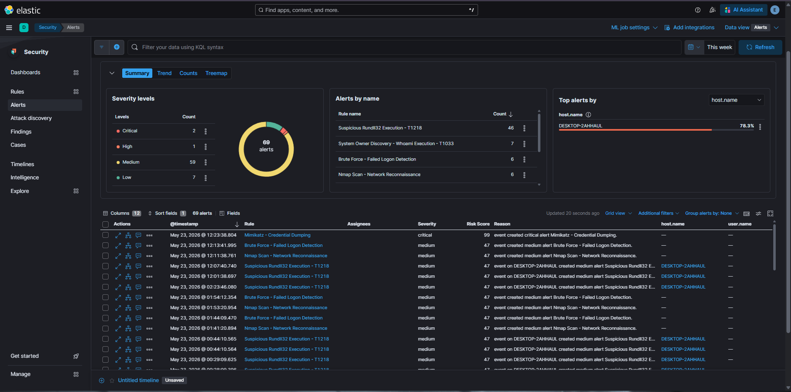
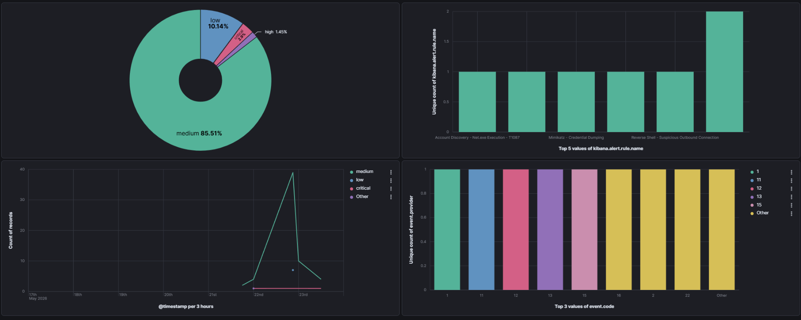

# 🔵 Home SIEM Lab — Elastic Stack


## 📌 Objetivo

Construir um ambiente SOC doméstico funcional para detecção de ameaças em tempo real, simulando ataques reais e desenvolvendo habilidades de Blue Team. O projeto cobre desde a infraestrutura até a criação de regras de detecção mapeadas ao framework MITRE ATT&CK, com relatórios de incidente formais baseados em dados reais do SIEM.

---

## 🏗️ Arquitetura



```
┌──────────────────────────────────────────────────┐
│              Rede Interna VirtualBox             │
│              10.200.200.0/24                     │
│                                                  │
│  ┌───────────────┐       ┌───────────────────┐   │
│  │   Kali Linux  │──────▶│   Windows 10      │   │
│  │   Atacante    │       │   Vítima          │   │
│  │ 10.200.200.10 │       │  10.200.200.20    │   │
│  └───────────────┘       │  + Sysmon         │   │
│                          │  + Winlogbeat     │   │
│                          └────────┬──────────┘   │
│                                   │              │
│                          ┌────────▼──────────┐   │
│                          │  Ubuntu Server    │   │
│                          │  ELK Stack        │   │
│                          │  10.200.200.30    │   │
│                          │  Elasticsearch    │   │
│                          │  Kibana           │   │
│                          └───────────────────┘   │
└──────────────────────────────────────────────────┘
```

---

## 🛠️ Ferramentas Utilizadas

| Ferramenta | Versão | Função |
|---|---|---|
| Elasticsearch | 8.x | Armazenamento e indexação de logs |
| Kibana | 8.19.15 | Visualização, dashboards e alertas |
| Winlogbeat | 9.4.1 | Coleta de logs do Windows |
| Sysmon | Latest | Telemetria avançada do Windows (354 campos) |
| Atomic Red Team | Latest | Simulação de ataques MITRE ATT&CK |
| Hydra | 9.x | Simulação de brute force |
| Nmap | Latest | Simulação de reconhecimento de rede |
| Mimikatz | 2.x | Simulação de dump de credenciais |
| VirtualBox | Latest | Virtualização do ambiente |

---

## 🎯 Detection Rules Criadas

| # | Regra | Tática MITRE | Técnica | Severidade | Evento |
|---|---|---|---|---|---|
| 1 | Brute Force - Failed Logon Detection | Credential Access | T1110.001 | 🟡 Medium | Event ID 4625 + LogonType 3 |
| 2 | Reverse Shell - Suspicious Outbound Connection | Command & Control | T1071 | 🔴 High | Sysmon ID 3, porta 4444 |
| 3 | Nmap Scan - Network Reconnaissance | Discovery | T1046 | 🟡 Medium | Sysmon ID 3, source IP |
| 4 | Mimikatz - Credential Dumping | Credential Access | T1003.001 | 🔴 Critical | Sysmon ID 1, mimikatz.exe |
| 5 | Suspicious Rundll32 Execution | Defense Evasion | T1218.011 | 🟡 Medium | Sysmon ID 1, rundll32.exe |
| 6 | System Owner Discovery - Whoami | Discovery | T1033 | 🟢 Low | Sysmon ID 1, whoami.exe |
| 7 | Account Discovery - Net.exe | Discovery | T1087.001 | 🟡 Medium | Sysmon ID 1, net.exe |
| 8 | Suspicious PowerShell Encoded Command | Defense Evasion | T1027 | 🔴 High | Sysmon ID 1, -EncodedCommand |

> 📥 Todas as regras estão disponíveis para importação em [`rules/rules_export.ndjson`](rules/rules_export.ndjson)

---

## ⚔️ Ataques Simulados

### 1. Brute Force RDP — T1110.001

**Ferramenta:** Hydra | **Origem:** Kali Linux | **IR:** [IR-007](incident-reports/IR-007-brute-force.md)

```bash
hydra -l Administrator -P /usr/share/wordlists/rockyou.txt rdp://10.200.200.20 -V -t 1
```

**Resultado:** 28 tentativas detectadas em ~2 minutos | Threshold de 10 atingido



---

### 2. Reconhecimento de Rede — T1046

**Ferramenta:** Nmap | **Origem:** Kali Linux | **IR:** [IR-005](incident-reports/IR-005-nmap.md)

```bash
nmap -sS -A 10.200.200.20
```

**Resultado:** 14 conexões detectadas em janela de 6 minutos

---

### 3. Reverse Shell — T1059 / T1071

**Ferramenta:** Netcat + PowerShell | **Origem:** Kali Linux | **IR:** [IR-004](incident-reports/IR-004-reverse-shell.md)

```bash
# Kali - Listener
nc -lvnp 4444
```

```powershell
# Windows - Reverse Shell
powershell -ExecutionPolicy Bypass -File C:\shell.ps1
```



---

### 4. Dump de Credenciais — T1003.001

**Ferramenta:** Mimikatz via Reverse Shell | **IR:** [IR-006](incident-reports/IR-006-mimikatz.md)

```
privilege::debug
sekurlsa::logonpasswords
```

**Resultado:** Alerta Critical disparado em **54 segundos** | Risk Score: 99



---

### 5. Simulações com Atomic Red Team

**Ferramenta:** Atomic Red Team | **Origem:** Windows

| Técnica | Descrição | IR |
|---|---|---|
| T1033 | System Owner Discovery (whoami) | [IR-002](incident-reports/IR-002-whoami.md) |
| T1087.001 | Account Discovery (net.exe) | [IR-003](incident-reports/IR-003-net-exe.md) |
| T1218.011 | Signed Binary Proxy Execution (rundll32) | [IR-001](incident-reports/IR-001-rundll32.md) |

```powershell
Invoke-AtomicTest T1033
Invoke-AtomicTest T1087
Invoke-AtomicTest T1218.011
```

**Resultado:** 43+ alertas gerados em uma única sessão

---

## 📊 Dashboards Kibana





### Visualizações criadas:
- **Alertas por Severidade** — Gráfico de pizza (Critical / High / Medium / Low)
- **Alertas por Regra** — Gráfico de barras com todas as detection rules
- **Timeline de Ataques** — Gráfico de área com linha do tempo
- **Top Eventos Sysmon** — Distribuição dos Event IDs capturados

---

## 📈 Resultados Obtidos

| Métrica | Resultado |
|---|---|
| Detection Rules criadas | 8 |
| Incident Reports formais | 7 |
| Alertas gerados em simulações | 43+ |
| Técnicas MITRE cobertas | 8 |
| Fontes de log | Windows Event Log + Sysmon |
| Campos indexados | 354 |
| Tempo médio de detecção | < 2 minutos |
| Detecção mais rápida | 54 segundos (Mimikatz) |

---

## 🗂️ Mapeamento MITRE ATT&CK

| Tática | ID Tática | Técnica | ID | Sub-técnica | Regra |
|---|---|---|---|---|---|
| Credential Access | TA0006 | Brute Force | T1110 | Password Guessing (T1110.001) | Brute Force - Failed Logon |
| Command & Control | TA0011 | Application Layer Protocol | T1071 | — | Reverse Shell Detection |
| Discovery | TA0007 | Network Service Discovery | T1046 | — | Nmap Scan Detection |
| Credential Access | TA0006 | OS Credential Dumping | T1003 | LSASS Memory (T1003.001) | Mimikatz Execution |
| Defense Evasion | TA0005 | System Binary Proxy Execution | T1218 | Rundll32 (T1218.011) | Suspicious Rundll32 |
| Discovery | TA0007 | System Owner/User Discovery | T1033 | — | Whoami Execution |
| Discovery | TA0007 | Account Discovery | T1087 | Local Account (T1087.001) | Net.exe Discovery |
| Defense Evasion | TA0005 | Obfuscated Files or Information | T1027 | — | PowerShell Encoded Command |

---

## 📝 Incident Reports

| ID | Título | Tática | Severidade | Data | IR |
|---|---|---|---|---|---|
| IR-001 | Execução Suspeita de Rundll32.exe | Defense Evasion | 🟡 Medium | 2026-05-23 | [Ver](incident-reports/IR-001-rundll32.md) |
| IR-002 | System Owner Discovery via Whoami | Discovery | 🟢 Low | 2026-05-23 | [Ver](incident-reports/IR-002-whoami.md) |
| IR-003 | Account Discovery via Net.exe | Discovery | 🟡 Medium | 2026-05-23 | [Ver](incident-reports/IR-003-net-exe.md) |
| IR-004 | Reverse Shell — Porta 4444 | Command & Control | 🔴 High | 2026-05-22 | [Ver](incident-reports/IR-004-reverse-shell.md) |
| IR-005 | Nmap Scan — Port Scan | Discovery | 🟡 Medium | 2026-05-22 | [Ver](incident-reports/IR-005-nmap.md) |
| IR-006 | Mimikatz — Credential Dumping | Credential Access | 🔴 Critical | 2026-05-23 | [Ver](incident-reports/IR-006-mimikatz.md) |
| IR-007 | Brute Force RDP | Credential Access | 🟡 Medium | 2026-05-23 | [Ver](incident-reports/IR-007-brute-force.md) |

---

## 📁 Estrutura do Repositório

```
home-siem-lab/
├── README.md
├── rules/
│   └── rules_export.ndjson         # 8 detection rules exportadas do Kibana
├── incident-reports/
│   ├── IR-001-rundll32.md
│   ├── IR-002-whoami.md
│   ├── IR-003-net-exe.md
│   ├── IR-004-reverse-shell.md
│   ├── IR-005-nmap.md
│   ├── IR-006-mimikatz.md
│   └── IR-007-brute-force.md
└── screenshots/
    ├── 01-elk-running.png
    ├── 02-kibana-discover.png
    ├── 03-event-4625.png
    ├── 04-hydra-attack.png
    ├── 05-reverse-shell.png
    ├── 06-mimikatz.png
    ├── 07-alerts-dashboard.png
    └── 08-kibana-dashboard.png
```

---

## 👤 Autor

**Henri Lopes**  
Cybersecurity — Blue Team | SOC Analyst

[](https://www.linkedin.com/in/henri-de-oliveira-lopes/)
[](https://github.com/henrilopes1)

---

## ⚠️ Aviso Legal

Este projeto foi desenvolvido exclusivamente para fins educacionais em ambiente isolado e controlado. Todas as simulações de ataque foram realizadas em máquinas virtuais próprias. Nunca utilize estas técnicas em sistemas sem autorização explícita.